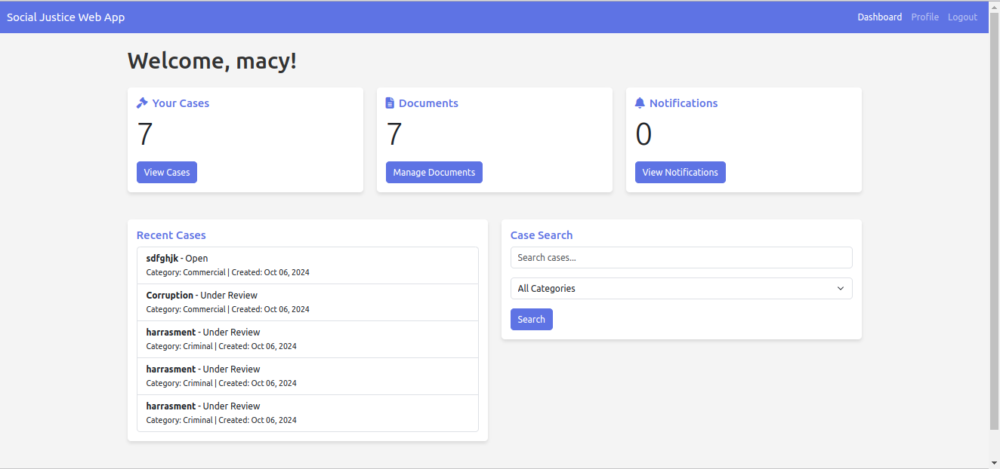

Here’s the updated README with the new video call feature:

---

# Haki_mkononi Web App


## Table of Contents
- [Introduction](#introduction)
- [Features](#features)
- [Technologies Used](#technologies-used)
- [Installation](#installation)
- [Usage](#usage)
- [API Integration](#api-integration)
- [Contributing](#contributing)
- [License](#license)

## Introduction

Haki_mkononi is a web application designed to streamline case management for legal professionals and provide easy access to legal services for citizens. The name "Haki_mkononi" translates to "Justice in your hands" in Swahili, emphasizing the app's goal of making legal processes more accessible.

Landing Page

## Features

- **User Authentication:** Secure login for citizens, legal professionals, and administrators
- **Case Management:**
  - Create and submit legal cases
  - Upload and manage case-related documents
  - Track case status and updates
- **Role-based Access Control:**
  - Citizens can view and manage their own cases
  - Legal professionals and admins have broader access to case information
- **Search Functionality:** Advanced search options to find cases by various criteria
- **SMS Notifications:** Automatic SMS updates on case status changes
- **Responsive Design:** Accessible on both desktop and mobile devices
- **Video Call Scheduling:** Users can schedule video calls with legal officials for virtual consultations and case discussions.



## Technologies Used

- **Backend:** Django
- **Database:** PostgreSQL
- **Frontend:** HTML, CSS, JavaScript
- **SMS Integration:** Africa's Talking API
- **File Storage:** Django's built-in file handling (for document uploads)
- **Video Call Integration:** WebRTC for video calling features


## Installation

1. Clone the repository:
   ```bash
   git clone https://github.com/Kelvin-Wepo/Haki_Mkononi
   cd haki_mkononi
   ```

2. Set up a virtual environment:
   ```bash
   python -m venv venv
   source venv/bin/activate  # On Windows use `venv\Scripts\activate`
   ```

3. Install dependencies:
   ```bash
   pip install -r requirements.txt
   ```

4. Set up environment variables:
   Create a `.env` file in the project root and add:
   ```bash
   SECRET_KEY=your_django_secret_key
   DEBUG=True
   AFRICAS_TALKING_USERNAME=your_username
   AFRICAS_TALKING_API_KEY=your_api_key
   ```

5. Run migrations:
   ```bash
   python manage.py migrate
   ```

6. Create a superuser:
   ```bash
   python manage.py createsuperuser
   ```

7. Run the development server:
   ```bash
   python manage.py runserver
   ```

## Usage

After installation, you can access the application at `http://localhost:8000`. Log in with your superuser credentials to access the admin panel and set up initial data.

For regular users:
1. Register an account
2. Log in to the system
3. Create a new case or search for existing cases (based on user role)
4. Upload relevant documents
5. Track case progress and receive SMS notifications
6. **Schedule video calls** with legal officials for consultations and case discussions

## API Integration

Haki_mkononi uses the Africa's Talking API for SMS notifications. To set this up:

1. Sign up for an account at [Africa's Talking](https://africastalking.com/)
2. Obtain your API credentials
3. Add these credentials to your `.env` file as shown in the Installation section

## Contributing

We welcome contributions to Haki_mkononi! Please follow these steps:

1. Fork the repository
2. Create a new branch (`git checkout -b feature/AmazingFeature`)
3. Commit your changes (`git commit -m 'Add some AmazingFeature'`)
4. Push to the branch (`git push origin feature/AmazingFeature`)
5. Open a Pull Request

## License

Distributed under the MIT License. See `LICENSE` file for more information.

---

For more information or support, please contact [support@haki_mkononi.com](mailto:support@haki_mkononi.com).